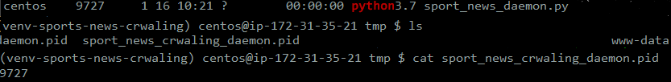

# sports_news_crwaling_daemon

### V1
 - https://github.com/taxijjang/sportsnews
 - 서버 개발자 초기에 만든 api

### 목적
- 인터넷 스포츠 뉴스를 많이보는데 뉴스를 보기 위해 매번 브라우저를 통하는 번거러움을 해소 하기 위함

### 개요

- 네이버, 다음의 카테고리별 인기 있는 스포츠 뉴스를 크롤링

- 일정 시간마다 크롤링을 하여 뉴스를 최신화 하기 위하여 daemon을 이용

### 구성요소

- 클라이언트 (텔레그램 챗 봇)

- 서버 (flask, daemon, redis)

### 작동 원리

- daemon을 통하여 일정시간 마다 스포츠 뉴스를 크롤링 한다.
- 크롤링한 뉴스를 redis에  key {플랫폼:카테고리} : value {뉴스 제목 : 뉴스 링크}로 저장
- flask를 이용하여 redis에 저장되어 있는 데이터를 rest api를 통하여 클라이언트에게 제공

### Django가 아닌 Flask를 선정한 이유

- 진행한 프로젝트는 일정 주기마다 크롤링을 하여 api로 응답을 해주는 간단한 프로젝트 이다. Django는 기본적인 웹 개발을 하기 위한 여러가지 서비스들을 이미 갖추고 있어 내가 사용하지 부분이 많지만 Flask는 경량화되어 있어 내가 필요한 요소요소들을 하나하나 추가하여 사용하면 되기 때문에 Flask가 프로젝트 진행에 알맞은 프레임워크라 생각하여 Flask를 선정 하게 되었다.

### Redis를 선정한 이유

- 실시간 뉴스는 일정 시간마다 갱신이 되는 구조이다. 즉 일정 시간이 되면 사용되지 않는 데이터라 생각 하였고, 뉴스의 갱신이 되지 않은 특정 시간동안에는 데이터를 읽어 오기만 하기 때문에, 입출력이 빠른 db를 사용하면 좋을거 같다 생각 하였고, 그중 인 메모리에서 작동하는 redis가 생각이나 사용하게 되었다.

# 결과

### response api

- Api Url

>- hostname/(flatform)/(category)

- Response_Data

### Redis Data keys

- Redis에 저장된 key의 목록

### Daemon 실행에 따른 pid

- Daemon 실행에 따른 pid

### API Document

- [Flat_Form_List](https://github.com/taxijjang/sports_news_crwaling_daemon/blob/master/api_document.md#flat_form_list-flat_form_list)

- [Category_List](https://github.com/taxijjang/sports_news_crwaling_daemon/blob/master/api_document.md#category_list-flat_form_listflat_form)

- [News_List](https://github.com/taxijjang/sports_news_crwaling_daemon/blob/master/api_document.md#news_list-flat_form_listcategory)

### 동작영상
- [텔레그램 챗봇](https://www.youtube.com/watch?v=BoiQiSIqQh4)
